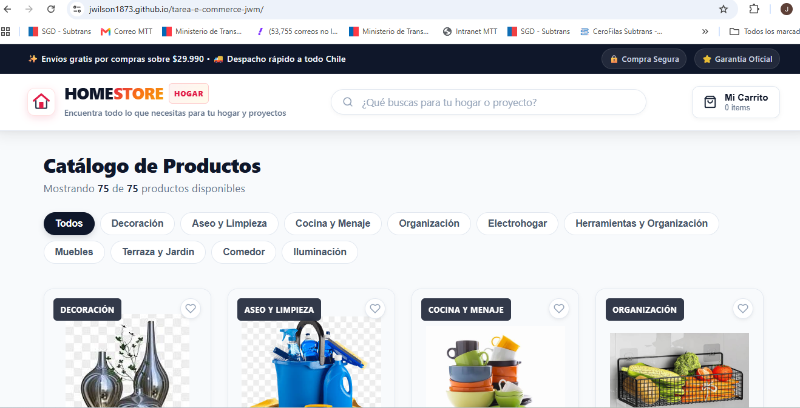
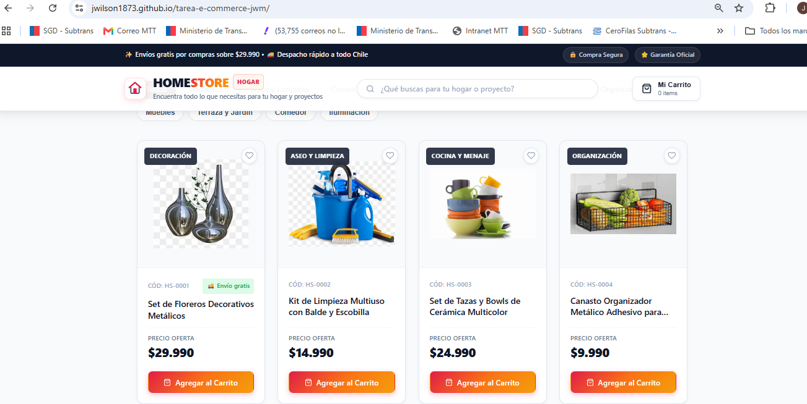
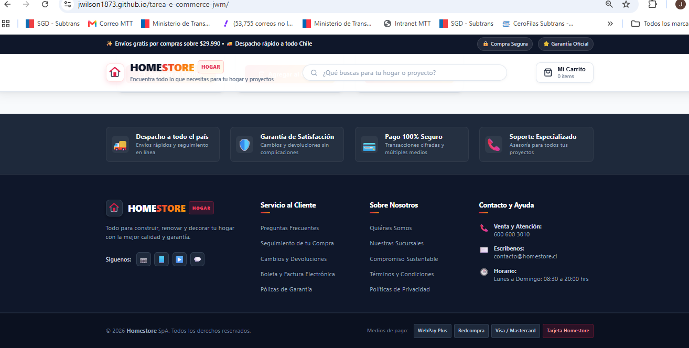

# Homestore E-commerce - Tarea Componentes en React

Plataforma de comercio electrónico moderna y estilizada para **Homestore** (Hogar, Muebles, Decoración, Terraza y Construcción), construida con React y Vite.

---

## 📋 Descripción del Proyecto

Este proyecto implementa la arquitectura y componentes reutilizables base para una tienda online de artículos del hogar, aplicando buenas prácticas de desarrollo en React:
- **Composición y modularidad**: Separación de responsabilidades con componentes atómicos y reutilizables.
- **Manejo de props y estados**: Componentes que reciben props fuertemente tipadas conceptualmente y gestionan estado local mediante hooks (`useState`, `useMemo`).
- **Renderizado eficiente de listas**: Mapeo de catálogos con uso estricto de `key` única basada en identificadores (`product.id`).
- **Simulación de datos local**: Catálogo completo de 75 productos mapeados desde `src/data/products.json` con imágenes, precios en CLP, nombres y categorías.

---

## 🧩 Componentes Creados (`/src/components`)

Todos los componentes se encuentran modularizados en sus respectivas carpetas dentro de `src/components/`, contando con su archivo JSX, estilos CSS y punto de entrada `index.js`:

| Componente | Carpeta | Descripción y Funcionalidad |
| :--- | :--- | :--- |
| **`ProductCard`** | `src/components/ProductCard/` | Muestra la información de un producto (`name`, `price`, `image`, `category`). Recibe props y maneja estado local con `useState` para alternar favoritos y dar feedback interactivo al agregar al carrito. |
| **`ProductList`** | `src/components/ProductList/` | Componente contenedor que renderiza la grilla de productos utilizando `map` y asignando la `key` obligatoria (`product.id`). |
| **`Button`** | `src/components/Button/` | Botón reutilizable con variantes (`primary`, `secondary`, `outline`, `ghost`), diferentes tamaños (`sm`, `md`, `lg`), soporte para íconos y estados disabled. |
| **`SearchBar`** | `src/components/SearchBar/` | Input controlado para búsqueda en tiempo real de productos y categorías con botón para limpiar el texto. |
| **`Header`** | `src/components/Header/` | Barra superior con logo, título comercial, lema, barra promocional y acceso interactivo al carrito con contador de artículos. |
| **`Footer`** | `src/components/Footer/` | Pie de página corporativo con beneficios de compra (envío, garantía, soporte), enlaces institucionales, redes sociales y medios de pago. |

---

## 🚀 Instrucciones para Ejecutar el Proyecto

### Requisitos previos
- Node.js (versión 18 o superior recomendada)
- npm o yarn

### Pasos de ejecución
1. **Clonar o abrir el repositorio**:
   ```bash
   git clone <URL_DEL_REPOSITORIO>
   cd tarea-e-commerce-jwm
   ```

2. **Instalar dependencias**:
   ```bash
   npm install
   ```

3. **Iniciar el servidor de desarrollo**:
   ```bash
   npm run dev
   ```
   Abre [http://localhost:5173](http://localhost:5173) en tu navegador web.

---

## 🛠️ Tecnologías Usadas
- **React 19**
- **Vite 8**
- **JavaScript Moderno (ES6+)**
- **CSS3** (Flexbox, CSS Grid, variables CSS, transiciones fluidas)
- **ESLint** (Reglas oficiales de React y Hooks)

---

## 📸 Capturas de Pantalla

### 1. Header del E-Commerce y Catálogo de Productos



### 2. Tarjetas de Producto (`ProductCard`)



### 3. Footer del E-Commerce 
