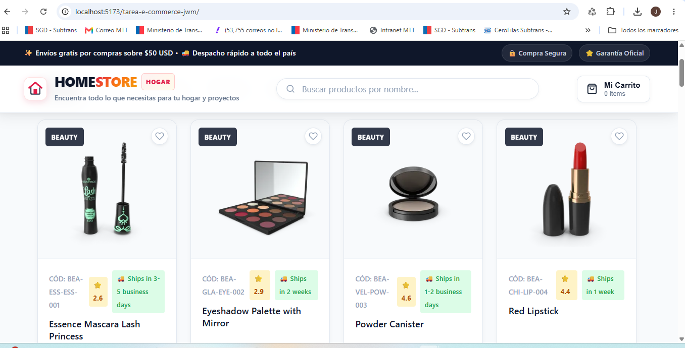
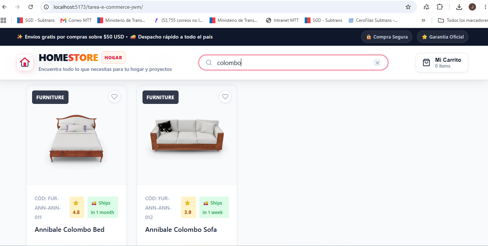

# Homestore E-commerce - Conexión con API DummyJSON

Plataforma de comercio electrónico moderna, dinámica y responsiva para **Homestore**, construida con React y Vite, conectada a la API pública de **DummyJSON** (`https://dummyjson.com/products`).

---

## 📋 Descripción del Proyecto

Este proyecto implementa una tienda online de catálogo dinámico que consume la API de productos de DummyJSON en tiempo real, renderiza los artículos de manera interactiva y proporciona una experiencia de usuario clara, estética y optimizada para cualquier dispositivo:

- **Consumo de API con React Hooks**: Implementación de `useEffect` y la API nativa `fetch` para consultar `https://dummyjson.com/products`.
- **Manejo completo de estados asíncronos**:
  - `loading`: Visualización interactiva y accesible mediante el componente `Loader` durante la petición.
  - `error`: Notificación clara mediante el componente `ErrorMessage` ante cualquier fallo de conexión o del servidor, permitiendo reintentar.
  - `products`: Almacenamiento y renderizado reactivo del catálogo recibido desde la API.
- **Búsqueda por nombre en tiempo real**: Filtrado dinámico e instantáneo a través del componente controlado `SearchBar`.
- **Filtro interactivo por categorías**: Extracción automática de las categorías retornadas por la API.
- **Componentes modulares y reutilizables**: Arquitectura limpia dividida en componentes atómicos con sus respectivos archivos JSX y CSS.
- **Diseño responsivo y accesible**: Adaptación completa a pantallas móviles, tablets y escritorio.

---

## 🧩 Lista de Componentes Creados (`/src/components`)

Todos los componentes se encuentran modularizados dentro del directorio `src/components/`, contando cada uno con su archivo JSX, estilos CSS dedicados y punto de entrada `index.js`:

| Componente | Carpeta | Requisito | Descripción y Funcionalidad |
| :--- | :--- | :---: | :--- |
| **`Header`** | `src/components/Header/` | Obligatorio | Logo distintivo de la tienda, nombre comercial ("Homestore"), eslogan, banner informativo superior y acceso interactivo al carrito de compras con contador de unidades. |
| **`SearchBar`** | `src/components/SearchBar/` | Obligatorio | Input controlado (`value`, `onChange`) para búsqueda en tiempo real de productos por nombre, incluyendo botón para limpiar el texto. |
| **`ProductCard`** | `src/components/ProductCard/` | Obligatorio | Muestra los datos del producto mediante props (`title`, `price`, `thumbnail`, `category`, `rating`). Maneja estado local con `useState` para marcar como favorito y feedback visual al agregar al carrito. |
| **`ProductList`** | `src/components/ProductList/` | Obligatorio | Renderiza la lista/grilla de productos utilizando `map` con su correspondiente `key` obligatoria (`product.id`). Muestra mensaje informativo si no hay coincidencias de búsqueda. |
| **`Loader`** | `src/components/Loader/` | Obligatorio | Indicador visual de carga animado con doble anillo y núcleo pulsante, accesible para lectores de pantalla (`role="status"`, `aria-live="polite"`). |
| **`ErrorMessage`** | `src/components/ErrorMessage/` | Obligatorio | Muestra errores cuando falla la conexión con la API o el servidor, incorporando un botón interactivo de acción para reintentar la consulta. |
| **`Footer`** | `src/components/Footer/` | Obligatorio | Pie de página con información básica de la tienda, beneficios comerciales (envío, garantía, soporte), enlaces corporativos, redes sociales y medios de pago. |
| **`Button`** | `src/components/Button/` | Adicional | Botón genérico altamente personalizable con variantes (`primary`, `secondary`, `outline`), tamaños y soporte de íconos SVG. |

---

## 🌐 Consumo de la API

La aplicación se comunica con el servicio público de DummyJSON según los lineamientos de la pauta:
- **Endpoint**: `https://dummyjson.com/products`
- **Hook utilizado**: `useEffect` con llamada asíncrona mediante `fetch`.
- **Cancelación y limpieza**: Uso de `AbortController` para cancelar solicitudes pendientes en caso de desmontaje del componente.
- **Gestión de estados**:
  - `loading`: Se inicializa en `true` y pasa a `false` al finalizar la carga.
  - `error`: Se establece ante códigos HTTP distintos de 2xx o problemas de red.
  - `products`: Almacena el array `data.products`.

---

## 🚀 Instrucciones para Ejecutar el Proyecto

### Requisitos previos
- **Node.js** (versión 18 o superior recomendada)
- **npm** (incluido con Node.js)

### Pasos de ejecución
1. **Clonar o abrir el repositorio**:
   ```bash
   git clone https://github.com/jwilson1873/tarea-e-commerce-jwm.git
   cd tarea-e-commerce-jwm
   ```

2. **Asegurarse de estar en la rama de la tarea**:
   ```bash
   git checkout feature/agregarapi
   ```

3. **Instalar dependencias**:
   ```bash
   npm install
   ```

4. **Iniciar el servidor de desarrollo**:
   ```bash
   npm run dev
   ```
   Abre [http://localhost:5173](http://localhost:5173) en tu navegador web.

5. **Construir para producción**:
   ```bash
   npm run build
   ```

---

## 🛠️ Tecnologías Usadas
- **React 19** (Hooks: `useState`, `useEffect`, `useMemo`)
- **Vite 8** (Empaquetador y entorno de desarrollo ultra rápido)
- **JavaScript Moderno (ES6+)** (Async/Await, Fetch API, AbortController)
- **CSS3** (Flexbox, CSS Grid, variables CSS, animaciones keyframes y diseño responsivo)
- **ESLint 10** (Reglas oficiales de React y verificación de hooks)

---

## 📸 Capturas de Pantalla del Resultado

### 1. Vista General del E-Commerce (Catálogo conectado a DummyJSON)


### 2. Ejemplo de búsqueda de productos  


